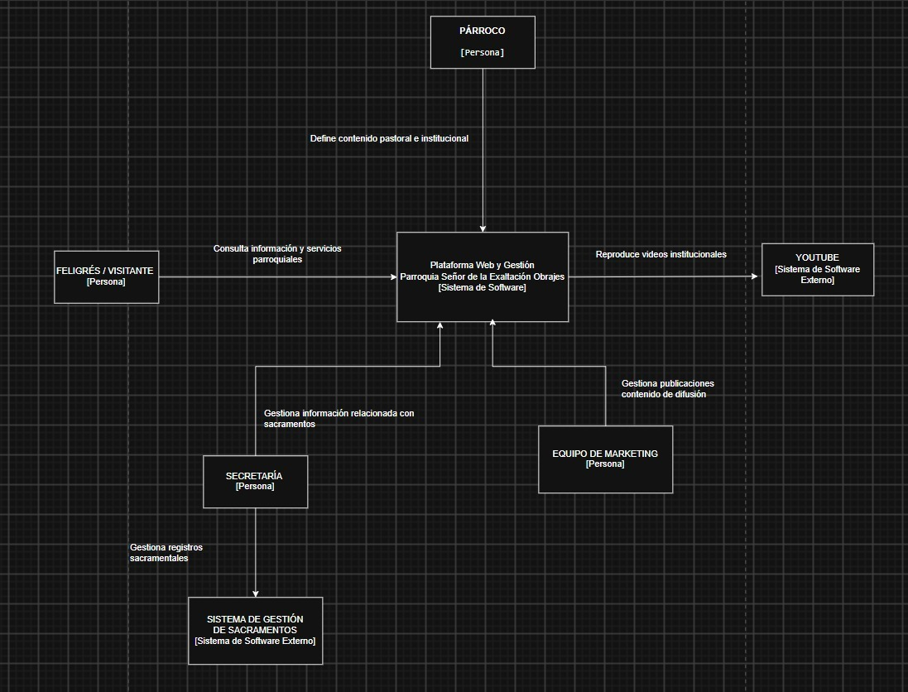
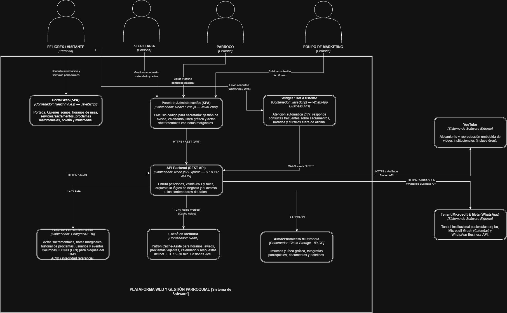
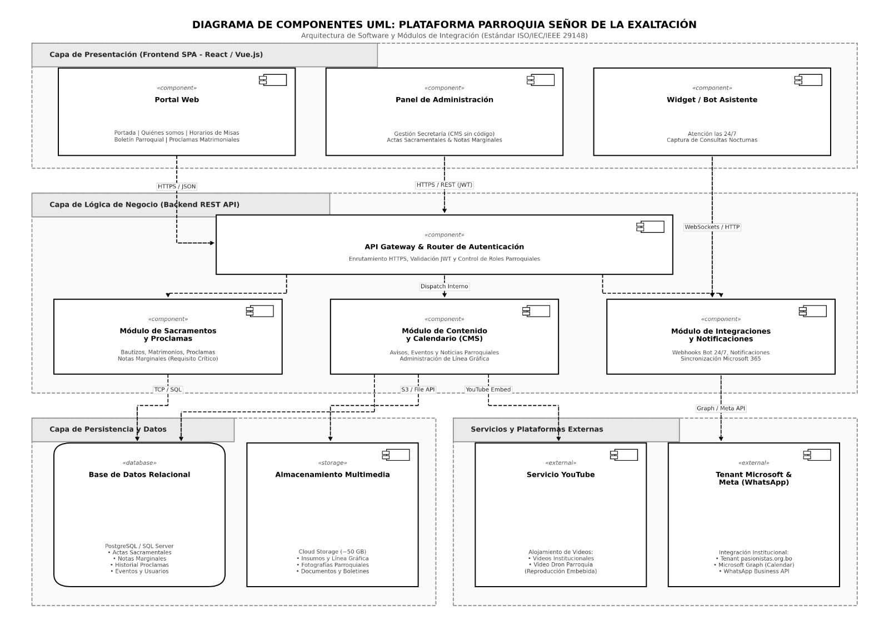

# Documento 3: Arquitectura de Software - Modelo C4

Este documento presenta la arquitectura del sistema aplicando el enfoque de zoom de Simon Brown (Niveles 1 al 3).

## C1 - Diagrama de Contexto
Delimitación de frontera del sistema, personas/actores principales y sistemas externos.

---

## C2 - Diagrama de Contenedores
Descomposición en bloques ejecutables especificando tecnologías y protocolos.

---

## C3 - Diagrama de Componentes
Zoom al contenedor Backend desglosando Controllers, Services, Repositories, etc.

---